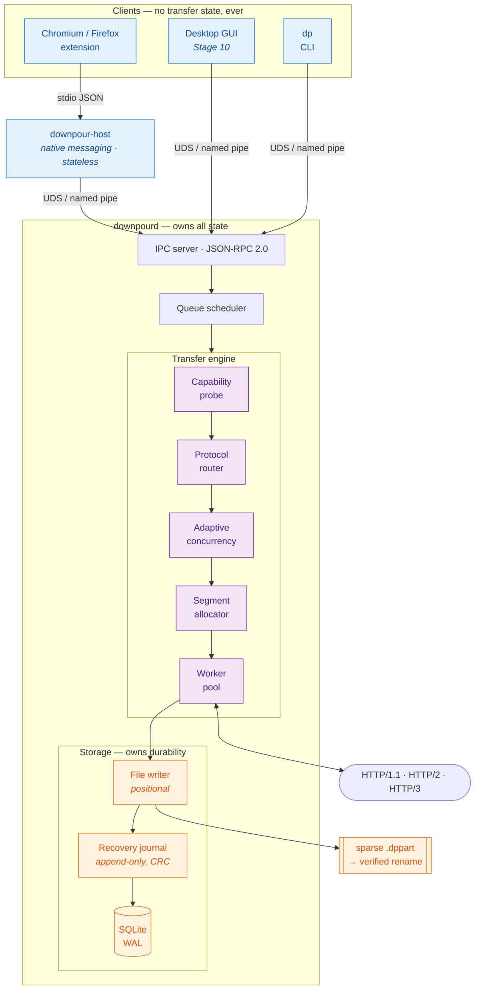
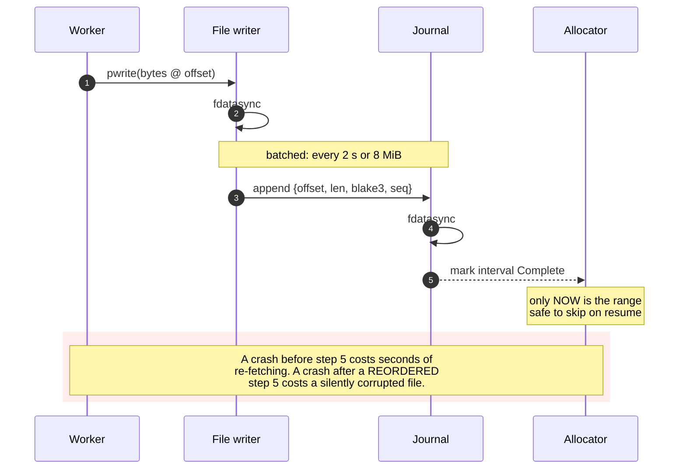
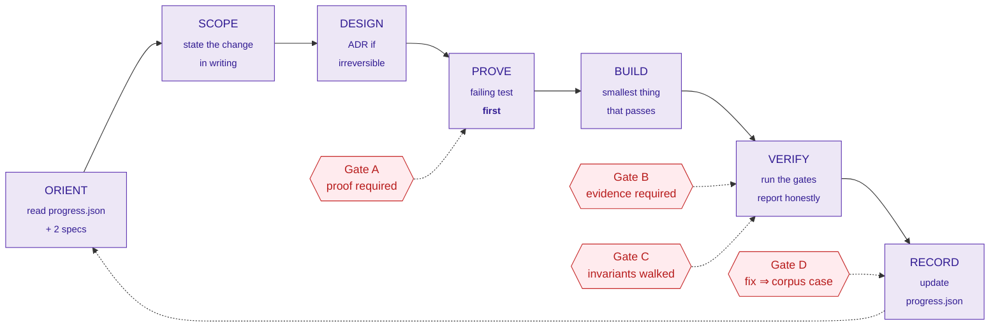

<div align="center">

# ☔ Downpour

**A protocol-aware, crash-safe download engine for Linux and Windows.**

*Open source. Apache-2.0. Built from scratch, in stages, in Rust.*

[](docs/12-roadmap-stages.md)
[](state/progress.json)
[](LICENSE)
[](rust-toolchain.toml)
[](docs/11-packaging-release.md)

[](https://gitlab.com/duochou042004/downpour/-/pipelines)
[](docs/agent/INVARIANTS.md)
[](docs/adr/README.md)
[](docs/09-testing-strategy.md)
[](docs/00-vision-and-scorecard.md)

[](docs/agent/HARNESS.md)
[](CONTRIBUTING.md)

</div>

---

> **Status: Stage 0 — Foundations.** There is no production code yet, and that is deliberate.
> This repository currently holds the specification, the decision record, and the operating
> harness that the engineering work will be built against.
> [`state/progress.json`](state/progress.json) is the authoritative status of every stage.

---

## Why this exists

Internet Download Manager is, functionally, the reference implementation of a desktop download
accelerator. It is Windows-only, closed-source, and paid. The open-source alternatives are each
strong in one dimension and weak in the others: `aria2` has a serious engine and no product
around it, AB Download Manager has a good product on a JVM runtime, Persepolis and XDM have had
recurring engine-correctness problems.

Downpour is an attempt at the whole thing: an engine that is **correct first and fast second**,
a daemon that survives the UI, browser integration that captures real download context, and a
test system that accumulates compatibility knowledge instead of guessing at it.

The target is stated plainly in [`docs/00-vision-and-scorecard.md`](docs/00-vision-and-scorecard.md):
**if IDM is 10/10, Downpour ships at 9.5/10 or it does not ship.** That number is a weighted,
measurable scorecard, not a feeling.

## What makes this different from "another aria2 wrapper"

IDM's real advantage was never a secret algorithm. Its published
[dynamic segmentation](https://www.internetdownloadmanager.com/support/segmentation.html) is a
page of text and can be reimplemented in a week. Its actual moat is **twenty-plus years of
accumulated compatibility handling** — thousands of misbehaving servers, expiring signed URLs,
connection-capping CDNs, proxies, and redirect chains, each with a rule or a fallback.

You cannot out-code that moat. You can only out-*test* it, and you can build on a protocol
generation IDM was not designed for. So Downpour makes two bets:

<table>
<tr>
<td width="50%" valign="top">

### 1. Adaptive scheduling, not fixed segmentation

HTTP/2 and HTTP/3 multiplex streams over one connection. Opening 16 TCP sockets is now often the
*slow* path — 16 handshakes, and a good way to trip a per-IP cap.

The engine measures the environment and chooses its own concurrency. The user's setting is a
**ceiling, never a target**.

→ [`docs/03-transfer-engine-spec.md`](docs/03-transfer-engine-spec.md)

</td>
<td width="50%" valign="top">

### 2. A compatibility corpus as the primary asset

Every server pathology becomes a permanent, deterministic, replayable test case, generated
deliberately in a lab rather than discovered in production over two decades.

**The corpus is the product. The engine is what runs against it.**

→ [`docs/09-testing-strategy.md`](docs/09-testing-strategy.md)

</td>
</tr>
</table>

## Architecture

The daemon owns all transfer state. Closing the window never stops a download. Every other
component is a client of a versioned IPC contract — which is also why the GUI toolkit choice is
a Stage 10 detail rather than a foundational bet.



Full detail: [`docs/02-architecture.md`](docs/02-architecture.md).

### The durability ordering

The single sequence that separates a download manager you can trust from one you cannot.
Reversing any two of these steps is the corruption bug that has shipped in most open-source
download managers at some point.



→ [`docs/04-storage-and-recovery-spec.md`](docs/04-storage-and-recovery-spec.md) §2.3, invariant
[I-1](docs/agent/INVARIANTS.md).

## Roadmap

Ten stages, each with a hard exit gate. No stage starts before the previous one's gate is green.
The stages that can be *silently* wrong come before the ones that are merely *visibly* wrong.

```mermaid
gantt
    title Downpour stages — gated, not time-boxed
    dateFormat X
    axisFormat %s

    section Foundations
    S0  specs · ADRs · harness         :active, s0, 0, 1
    section Engine correctness
    S1  single-stream downloader       :s1, after s0, 1
    S2  range · resume · crash safety  :crit, s2, after s1, 1
    S3  dynamic segmentation           :s3, after s2, 1
    S4  adaptive concurrency           :s4, after s3, 1
    section Protocol reach
    S5  HTTP/2 streams                 :s5, after s4, 1
    S6  HTTP/3 · QUIC                  :s6, after s5, 1
    section Product
    S7  browser extension              :s7, after s6, 1
    S8  signed URLs · auth · proxies   :s8, after s7, 1
    S9  HLS · DASH                     :s9, after s8, 1
    S10 UI · queue · packaging         :s10, after s9, 1
```



| Stage | Deliverable | Gate hinges on |
| :---: | ----------- | -------------- |
| **S0** | Specs, ADRs, agent harness, CI | A fresh agent session can orient itself unaided |
| **S1** | Single-stream HTTP/1.1 + HTTP/2 downloader | Probe classifies range support correctly |
| **S2** | Range, resume, validators, crash-safe storage | **Crash injection at every write boundary** |
| **S3** | Dynamic segmentation | No overlapping writes under adversarial scheduling |
| **S4** | Adaptive concurrency + ETA work stealing | Never slower than one connection |
| **S5** | HTTP/2 stream parallelism | One handshake beats N |
| **S6** | HTTP/3 / QUIC backend | Feature flag removes it with zero scheduler impact |
| **S7** | Browser extension + native host | Context capture works where a bare URL fails |
| **S8** | Signed-URL refresh, auth, proxies | Refresh keeps existing bytes; refuses on mismatch |
| **S9** | HLS / DASH (no DRM) | Byte-identical to a reference remux |
| **S10** | UI, queue, packaging, release | The scorecard, scored with evidence |

**S2 is the highest-risk stage in the project.** Everything after it depends on storage being
trustworthy, and a defect there is invisible until it is catastrophic.

Detail and exit criteria: [`docs/12-roadmap-stages.md`](docs/12-roadmap-stages.md).

## The scorecard

"9.5 out of 10" is a weighted table, scored with reproducible evidence, published with its gaps
intact.

| # | Category | Weight | Now |
| - | -------- | -----: | --: |
| 1 | Correctness — no corrupted files | 25 | — |
| 2 | Resume, crash recovery, URL refresh | 20 | — |
| 3 | Speed and bandwidth utilisation | 20 | — |
| 4 | Server, proxy, auth compatibility | 15 | — |
| 5 | Browser integration and media detection | 15 | — |
| 6 | Resource use, UX, packaging | 5 | — |
| | **Target** | **100** | **≥ 95** |

> **Category 1 is not tradeable.** Any silent-corruption finding is an automatic release block,
> regardless of the other 75 points. A download manager that is fast and occasionally hands you
> a broken ISO is worse than useless, because the user does not find out until much later and
> does not know to blame it.

## Getting started

Nothing to install yet — Stage 1 is the first runnable binary. To work on the project:

```bash
git clone https://gitlab.com/duochou042004/downpour.git
cd downpour
just setup     # install git hooks, then check the environment
just brief     # what stage we are in and what is open
just gate      # run every gate that applies right now
```

`just doctor` prints exact install commands for anything missing. It never installs anything
itself.

## Repository map

| Path | Purpose |
| ---- | ------- |
| [`docs/`](docs/README.md) | The specification. Numbered documents are normative. |
| [`docs/adr/`](docs/adr/README.md) | Architecture Decision Records — every irreversible choice, with its reversal trigger. |
| [`docs/agent/`](docs/agent/HARNESS.md) | The operating harness for AI coding agents. |
| [`state/progress.json`](state/progress.json) | Single source of truth for status. Machine-validated. |
| [`plugins/`](plugins/README.md) | Dual-agent plugin marketplace (Claude Code + Codex). |
| `.claude/` · `.codex/` · `.agents/` | Per-agent configuration. |
| `.githooks/` | Agent-agnostic enforcement at the commit boundary. |
| `crates/` · `extensions/` · `tests/corpus/` | *(Stage 1+)* |

## Built by AI agents, on purpose

This repository is built primarily by **Claude Code** and **OpenAI Codex** under human
direction. That is a design constraint, not a footnote: an AI agent is a fast, tireless,
literal builder with no memory of yesterday and a strong bias toward *appearing* productive.
Left unguided it produces a large volume of plausible code that does not compose into a system.

So the project ships a harness that turns speed into a working product rather than a mess:



The enforcement is real, not advisory:

- `state/progress.json` is validated by a zero-dependency script that rejects a `done` task with
  no `proof` and a `met` criterion with no evidence.
- Claude Code cannot end a turn that changed source without recording it (`Stop` hook).
- `.githooks/pre-commit` applies the same rule to **every** agent and human.
- Both agents load the same skills from one source, and CI fails if the copies drift apart.

Start here: [`docs/agent/HARNESS.md`](docs/agent/HARNESS.md) ·
[`CLAUDE.md`](CLAUDE.md) · [`AGENTS.md`](AGENTS.md) ·
[`docs/agent/CODEX-NOTES.md`](docs/agent/CODEX-NOTES.md)

## Legal and ethical boundaries

Settled decisions, not open questions — see [ADR-0008](docs/adr/0008-no-drm-no-mitm.md).

| | |
| --- | --- |
| ❌ | **No DRM circumvention.** Encrypted HLS/DASH is not offered, not offered-with-a-warning. |
| ❌ | **No TLS interception.** No MITM proxy, no injected root CA, not even opt-in. |
| ❌ | **No access-control bypass.** The controller backs off on `429`; it does not rotate around it. |
| ❌ | **No IDM binary analysis.** Black-box study only: public docs and our own test servers. |
| ❌ | **No telemetry.** The only traffic Downpour generates is the downloads you asked for. |

Downpour downloads what the user is already authorised to download, using the session their own
browser already holds. → [`docs/10-security-privacy-legal.md`](docs/10-security-privacy-legal.md)

## Prior art worth respecting

Studied for design, never copied — note the licences before borrowing anything.

[aria2](https://github.com/aria2/aria2) (GPL-2.0+) · [AB Download Manager](https://github.com/amir1376/ab-download-manager) (Apache-2.0) · [gopeed](https://github.com/GopeedLab/gopeed) (GPL-3.0) · [XDM](https://github.com/subhra74/xdm) (GPL-2.0) · [Persepolis](https://github.com/persepolisdm/persepolis) (GPL-3.0) · [curl](https://curl.se) · [yt-dlp](https://github.com/yt-dlp/yt-dlp)

## Contributing

[`CONTRIBUTING.md`](CONTRIBUTING.md). Branch from `develop`, merge back via MR; `master` is
release-only. Security issues go to [`SECURITY.md`](SECURITY.md), not the issue tracker.

## License

[Apache-2.0](LICENSE) — permissive, with an explicit patent grant.
Rationale: [ADR-0006](docs/adr/0006-license-apache-2.md).

<div align="center">
<sub>Correctness outranks speed. A silently corrupted file is a catastrophic bug;<br/>
being 20% slower than IDM is a normal one.</sub>
</div>
